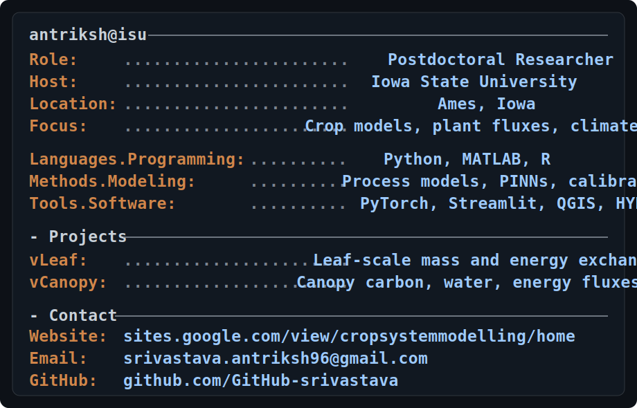

  

## Research Focus

- Crop modeling under climate variability and climate change
- Leaf-to-canopy scaling of photosynthesis, transpiration, and energy balance
- Stomatal conductance, water-use efficiency, and plant-environment interactions
- Scientific machine learning, optimization, calibration, and uncertainty analysis

## Tools and Models

| Project | Description | Stack |
| --- | --- | --- |
| [vLeaf](https://github.com/GitHub-srivastava/vLeaf) | Leaf-scale mass and energy exchange model | MATLAB / Python |
| [vCanopy](https://github.com/GitHub-srivastava/vCanopy) | Canopy-scale carbon, water, and energy flux model | MATLAB |
| PhotoFit | Photosynthetic parameter fitting from A-Ci gas-exchange data | Python / Streamlit |

## Technical Stack

**Languages:** Python, MATLAB, R  
**Libraries and tools:** PyTorch, scikit-learn, Streamlit, QGIS, HYDRUS-1D  
**Methods:** Process-based modeling, PINNs, optimization, calibration, uncertainty analysis

## Connect

- Website: [cropsystemmodelling](https://sites.google.com/view/cropsystemmodelling/home)
- Email: [srivastava.antriksh96@gmail.com](mailto:srivastava.antriksh96@gmail.com)
- GitHub: [GitHub-srivastava](https://github.com/GitHub-srivastava)
